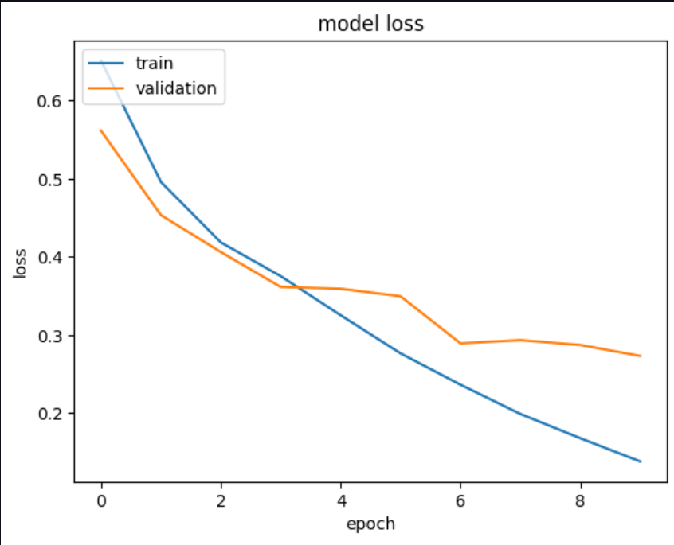
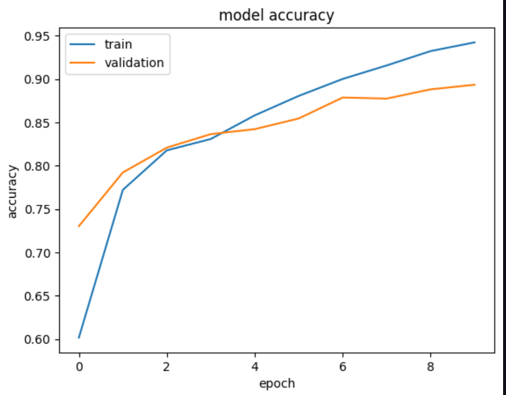

# Gender Classification using CNNs

This project focuses on classifying the gender of individuals from facial images. It employs a combination of techniques including transfer learning, fine-tuning, and custom CNN models.

## Overview

1. **Transfer Learning with VGG16**
   - Trained on a dataset of 12,000 face images.
   - Achieved 55% accuracy, but was slower than desired.

2. **Fine-tuned Model from Hugging Face (rizvandwiki)**
   - Improved performance using a pre-trained model specifically designed for gender detection.
   - Provided a good balance of accuracy and speed.

## Selected Model

After training multiple CNN models on a dataset of 12,000+ images with corresponding testing on 5,000+ samples, the following results were obtained:

1. **Model 1:**
   - Train Accuracy: 86%
   - Test Accuracy: 85%

2. **Model 2:**
   - Train Accuracy: 90%
   - Test Accuracy: 89%

3. **Model 3:**
   - Train Accuracy: 85%
   - Test Accuracy: 83%

Given these results, the second model was selected for the final implementation. It demonstrated a commendable balance between training and testing accuracy, achieving 90% and 89% respectively.

## Graphical representation of the Loss 


## Graphical representation of the accuracy



## Application Setup

### Download the Best fitted model ~

[Click Here](hhttps://drive.google.com/file/d/1YhnwqgYIVEd92hvoZwwsxpq2qDEM65Q9/view?usp=drive_link)

### Requirements
- Python 3.x
- OpenCV
- download the model & keep it in your working Directory
- [Gender Detection Model by rizvandwiki](https://huggingface.co/rizvandwiki/gender-classification-2)

How to Use the Fine-tuned model

```bash
from transformers import AutoFeatureExtractor, AutoModelForImageClassification

extractor = AutoFeatureExtractor.from_pretrained("rizvandwiki/gender-classification-2")
model = AutoModelForImageClassification.from_pretrained("rizvandwiki/gender-classification-2")
inputs = extractor(images = train_images[image_name], return_tensors="pt" )
    with torch.no_grad():
        logits = model(**inputs).logits
        predicted_label = logits.argmax(-1).item()
        label = model.config.id2label[predicted_label]


### How to Use

1. **Clone the Repository**
   ```bash
   git clone https://github.com/your_username/your_project.git
   cd your_project 


